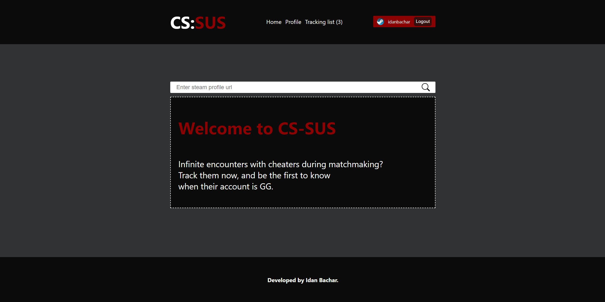

# CS:SUS (Counter-Strike: Suspect Searcher)

CS:SUS is a comprehensive tool designed for enthusiasts of the game Counter-Strike: Global Offensive. This tool provides detailed analytics of a player's performance and metrics to gauge the likelihood of cheating. Integrated with Steam's authentication, users can not only fetch data about any player but also track suspect profiles and get notifications about their VAC ban status.

## Features:

1. **Steam Profile Search**: Enter a Steam profile URL to fetch the CS:GO statistics.
2. **Cheater Probability Score**: Based on various metrics and analytics, get a percentage score indicating the likelihood of a profile being a cheater.
3. **Steam Login Integration**: Securely log in using your Steam account.
4. **Tracking List**: Add profiles to your tracking list and keep an eye on them.
5. **Email Notifications (SOON)**: Get notified when a player from your tracking list receives a VAC ban.

## Technologies Used

- React
- Steam API
- Node.js (for the backend)
- Firebase (for tracking)

## License

This project is licensed under the MIT License. See the [LICENSE.md](link-to-your-license-md-file) for details.

## Frequently Asked Questions (FAQ)

### How is the Cheater Probability Score calculated?

The Cheater Probability Score is based on a combination of metrics from the player's CS:GO statistics, anomalies in the player's CS:GO total playtime, steam level, total badges, total friends, account age, inventory items price, some statistics like headshot percentage, total kills and various other data points fetched from the Steam API. While the score provides an indication, it's essential to understand that it's a heuristic, and there might be false positives.

### What happens if I forget my Steam login for this application?

Don't worry! We don't store your Steam credentials. The login mechanism is handled through Steam's OAuth2.0, ensuring that your data remains secure. If you're logged out, you can always log in again using the 'Login with Steam' button.

### How often are the email notifications sent?

Work in progress.

### How do I remove a player from my tracking list?

Once logged in, navigate to your tracking list. Next to each player's name, there's a 'Stop tracking' button. Clicking on it will immediately remove the player from your list and stop further notifications about that player.

## Acknowledgments

- Special thanks to the developers of the Steam API for making this project possible.
